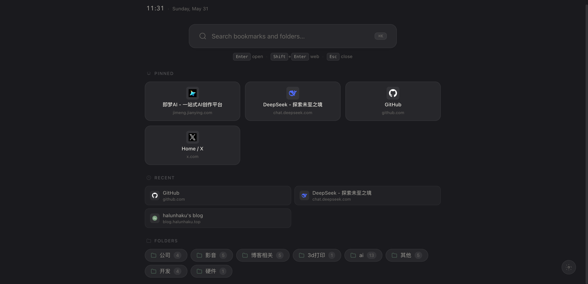
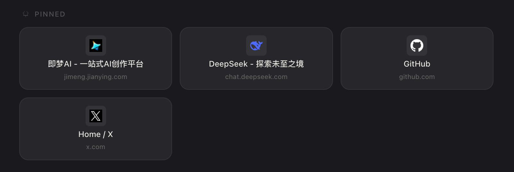
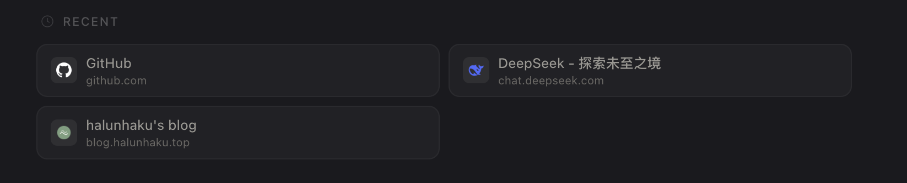
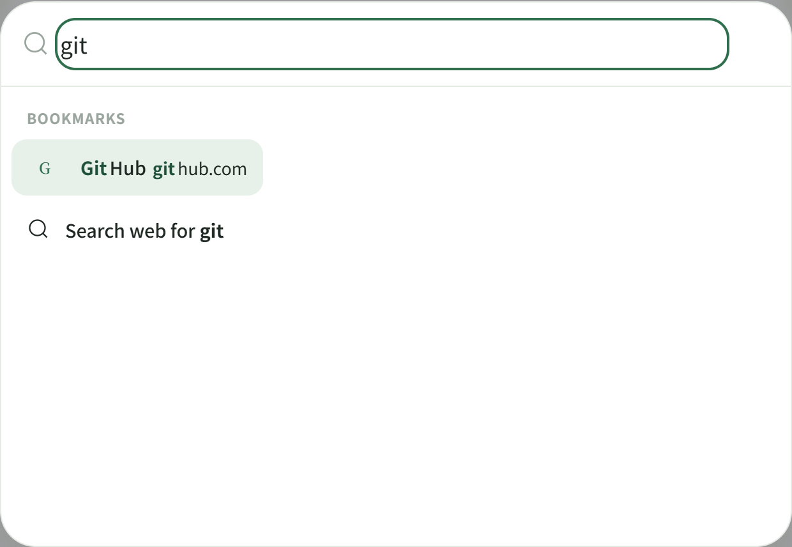
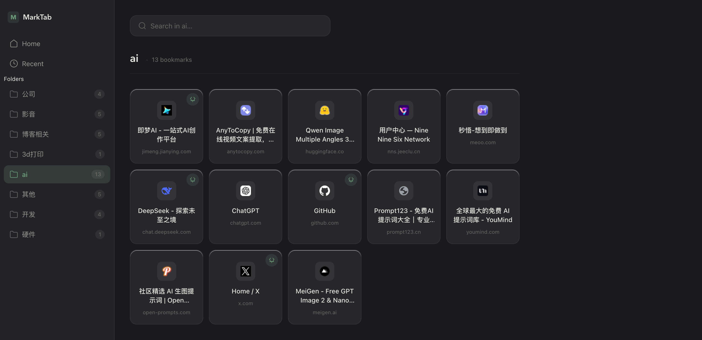
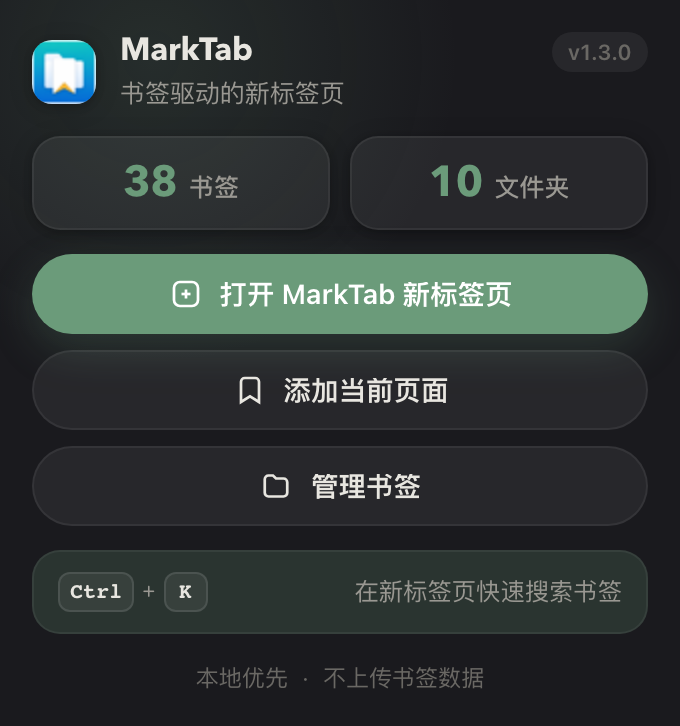

<p align="center">
  
</p>

<h1 align="center">MarkTab</h1>

<p align="center">
  MarkTab 是一个以书签为核心的浏览器新标签页扩展，用更安静、清晰、快速的方式管理和访问你的常用网页。
</p>

<p align="center">
  <code>Manifest V3</code>
  · <code>Chrome Extension</code>
  · <code>Edge Compatible</code>
  · <code>MIT License</code>
  · <code>v1.3.2</code>
</p>

---

## Preview / 预览

README 预览截图位于 `screenshots/`，按功能视图单独维护，避免和 Chrome Web Store 素材混在一起。

| Home / 首页 |
| --- |
|  |

| Pinned / 固定书签 | Recent / 最近访问 |
| --- | --- |
|  |  |

| Spotlight / 快速搜索 | Folder View / 文件夹视图 |
| --- | --- |
|  |  |

| Popup / 快捷面板 |
| --- |
|  |

## Features / 功能

MarkTab 直接使用浏览器书签作为数据源，把 New Tab 变成一个轻量的 Bookmark dashboard。

| 能力 | 说明 |
| --- | --- |
| 新标签页替换 | 通过 `chrome_url_overrides.newtab` 替换默认新标签页。 |
| Spotlight 搜索 | 搜索书签标题、URL 和文件夹，并支持一键提交网页搜索。 |
| Pinned 固定书签 | 在首页固定高频书签，减少重复寻找。 |
| Recent 最近访问 | 记录通过 MarkTab 打开的书签，保留在本地设置中。 |
| 文件夹视图 | 以侧边栏和网格卡片浏览浏览器书签文件夹。 |
| 文件夹内搜索 | 在当前文件夹内快速过滤书签。 |
| 键盘操作 | 支持搜索打开、结果导航、打开结果和关闭面板。 |
| 主题外观 | Light、Dark、System 三种主题，以及多种低饱和强调色。 |
| 本地优先 | 不依赖开发者云服务，不上传书签、文件夹或设置数据。 |

## Design Philosophy / 设计理念

MarkTab 的界面目标是长期使用，而不是制造短暂的新鲜感。它参考项目设计规范中“干净、圆润、克制、有产品感”的方向，用低饱和色、轻阴影、清晰层级和充足留白降低新标签页的打扰感。

设计上更关注几个具体问题：

- 让书签重新变得可用：搜索、Pinned、Recent 和 Folder View 分别对应不同访问路径。
- 信息密度适中：首页只保留高频入口，完整列表交给文件夹视图。
- 低干扰：强调色只用于状态、焦点和关键操作，不把新标签页做成内容流。
- 可恢复：隐藏文件夹、主题、固定书签等偏好都保存在浏览器存储中，保持体验连续。

## Installation / 安装

### 从 GitHub Release 安装

1. 在 GitHub Releases 中下载最新的 `marktab-1.3.2.zip`。
2. 解压 zip 到一个固定的本地文件夹。
3. 打开扩展管理页面：
   - Chrome: `chrome://extensions/`
   - Edge: `edge://extensions/`
4. 启用「开发者模式」。
5. 点击「加载已解压的扩展程序」。
6. 选择解压后的 MarkTab 文件夹。

### 开发者模式安装

1. 克隆或下载本仓库。
2. 打开 `chrome://extensions/` 或 `edge://extensions/`。
3. 启用「开发者模式」。
4. 点击「加载已解压的扩展程序」。
5. 选择项目根目录 `/marktab`。

## Usage / 使用

- 打开新标签页即可进入 MarkTab 首页。
- 点击首页搜索框，或使用快捷键打开 Spotlight 搜索。
- 在搜索结果中打开书签、进入文件夹，或提交网页搜索。
- 进入 Folder View 后，可以在文件夹内搜索并固定常用书签。
- 使用扩展弹窗查看书签统计、打开新标签页、添加当前页面为书签或进入浏览器书签管理器。

## Keyboard Shortcuts / 快捷键

以下快捷键来自当前代码实现。

| 快捷键 | 作用 |
| --- | --- |
| `/` | 打开或关闭 Spotlight 搜索，输入框聚焦时不会触发。 |
| `Ctrl/Cmd + K` | 打开或关闭 Spotlight 搜索。 |
| `↑` / `↓` | 在搜索结果中移动选中项。 |
| `Enter` | 打开当前选中的书签、文件夹或网页搜索项。 |
| `Shift + Enter` | 使用浏览器默认搜索引擎搜索当前输入内容。 |
| `Esc` | 关闭 Spotlight 搜索；在文件夹搜索框中清空过滤并取消焦点。 |

## Permissions / 权限说明

MarkTab 保持 Manifest V3 权限范围尽量小。当前权限如下：

| 权限 | 用途 |
| --- | --- |
| `bookmarks` | 读取书签树、展示书签和文件夹、统计数量，并在用户点击弹窗中的「添加当前页面」时创建书签。 |
| `favicon` | 通过 Chrome 内置 favicon 服务显示网站图标；加载失败时回退到首字母图标。 |
| `search` | 用户主动提交网页搜索时，通过 Chrome Search API 调用浏览器默认搜索引擎。 |
| `storage` | 保存主题、强调色、隐藏文件夹、Pinned 书签和 Recent 记录等偏好。 |
| `activeTab` | 仅在用户点击「添加当前页面」时读取当前标签页标题和 URL，用于创建书签。 |

## Privacy / 隐私

MarkTab 不收集用户数据，不上传书签标题、书签 URL、文件夹名称、搜索记录、访问记录或设置数据到开发者服务器。所有数据只用于本地新标签页体验。

用户主动提交网页搜索时，搜索词会交给浏览器默认搜索引擎处理。完整说明见 [PRIVACY_POLICY.md](./PRIVACY_POLICY.md)。

## Development / 开发

MarkTab 是一个无框架的 Manifest V3 扩展，运行时代码位于仓库根目录。当前没有 `npm run dev` 脚本；本地调试通常直接在浏览器中加载项目根目录。

```bash
npm install
```

| 命令 | 用途 |
| --- | --- |
| `npm run validate` | 校验发布所需文件、权限、Manifest V3 约束和文档权限说明。 |
| `npm run package` | 先执行校验，再生成 `dist/marktab-1.3.2.zip`。 |
| `npm run release:zip` | `npm run package` 的别名。 |
| `npm run inspect:zip` | 查看当前 release zip 的文件列表。 |
| `npm run screenshots` | 使用 Playwright 更新 `store-assets/` 中的截图资源。 |
| `npm run bump -- 1.3.2` | 同步更新 `package.json`、`manifest.json`、README、提交说明和弹窗版本号。 |

## Project Structure / 项目结构

```text
marktab/
├─ manifest.json                  # Manifest V3 配置、权限和入口
├─ newtab.html                    # 新标签页页面
├─ newtab.js                      # 书签读取、搜索、Pinned、Recent、主题和视图逻辑
├─ styles.css                     # MarkTab 设计系统与界面样式
├─ popup.html                     # 扩展弹窗
├─ popup.js                       # 弹窗统计、添加当前页面、书签管理入口
├─ icons/                         # 扩展图标
├─ store-assets/                  # README / 商店截图与宣传图
├─ scripts/                       # 校验、截图、版本更新脚本
├─ CHROME_STORE_SUBMISSION.md     # Chrome Web Store 提交说明
├─ PRIVACY_POLICY.md              # 隐私政策
├─ README.md
└─ package.json
```

> 当前项目没有 `src/` 或 `public/` 目录；扩展运行文件直接位于仓库根目录，图标位于 `icons/`。

## Release / 发布

发布前建议按以下顺序检查：

```bash
npm run validate
npm run package
npm run inspect:zip
```

生成的 zip 位于 `dist/marktab-1.3.2.zip`。上传前请确认压缩包只包含运行所需的 `manifest.json`、HTML、CSS、JS 和图标文件。Chrome Web Store 提交说明见 [CHROME_STORE_SUBMISSION.md](./CHROME_STORE_SUBMISSION.md)。

## Roadmap / 后续计划

- 更好的书签组织方式，尤其是大量文件夹场景。
- 更多可预期的键盘操作。
- 继续优化主题、强调色和深色模式细节。
- 准备 Chrome Web Store 发布资料。
- 评估 Edge Add-ons 支持与提交流程。

## License

MIT
